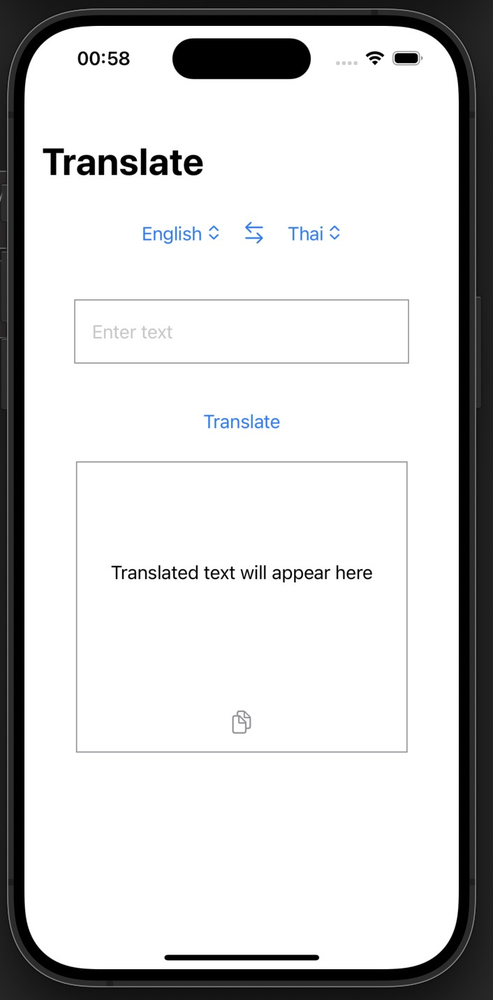
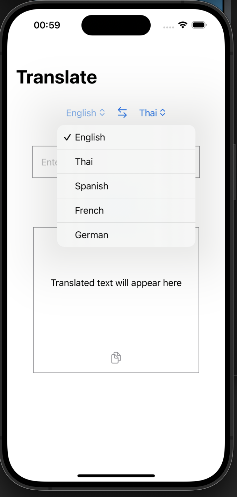
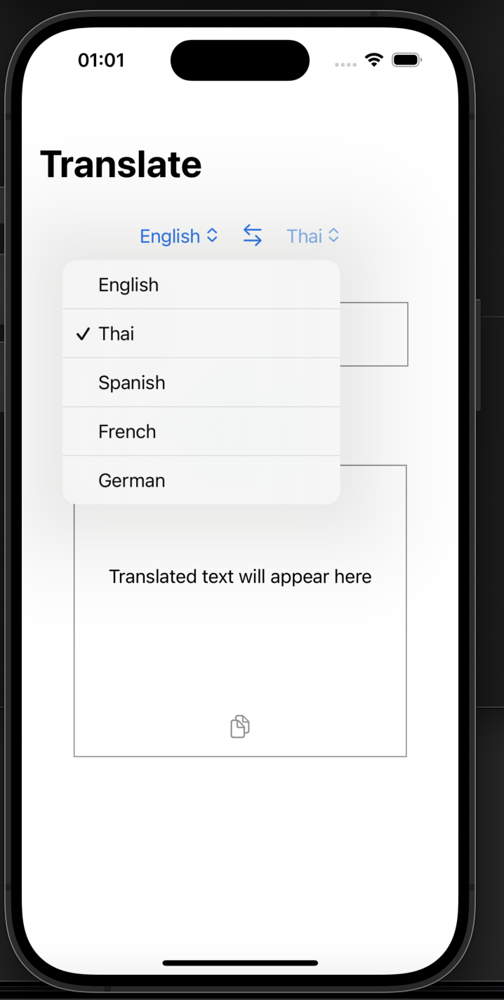
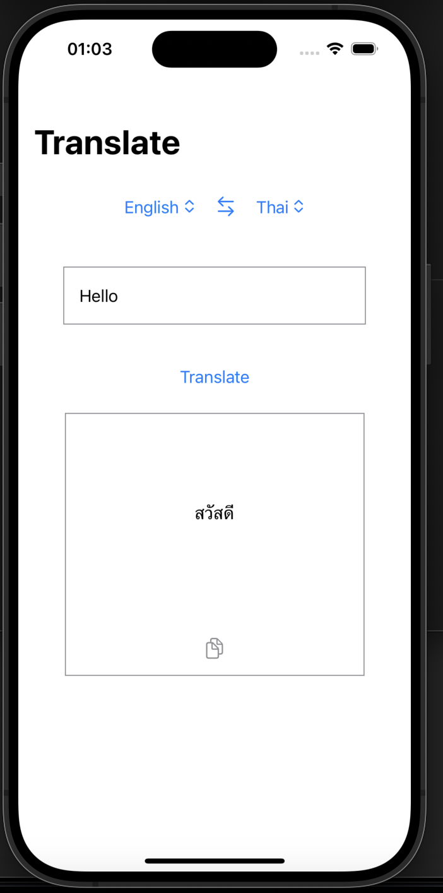
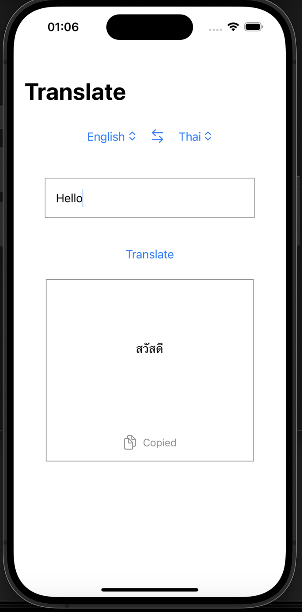

# CN436-AS3
6410615030 Natiphon Chanphet
[Demo Clip](https://youtu.be/mer3tfNXnS8)

# Translate App

### How to use

* Here is the start page

* Select the input language by tapping on the dropdown menu on the left. A list will appear displaying the languages available for translation, which includes English, Thai, Spanish, French, and German.

* Choose the target language by tapping on the dropdown menu on the right. It will display the same list of languages as the input menu. You can also tap the arrows between the dropdown menus to swap the selected input and target languages.

* Type text into the "Enter text" field and press the "Translate" button. The translated text will appear in the area below the "Translate" button.

* If you want to copy the translated text to use elsewhere, tap the copy icon located next to the translated text.

